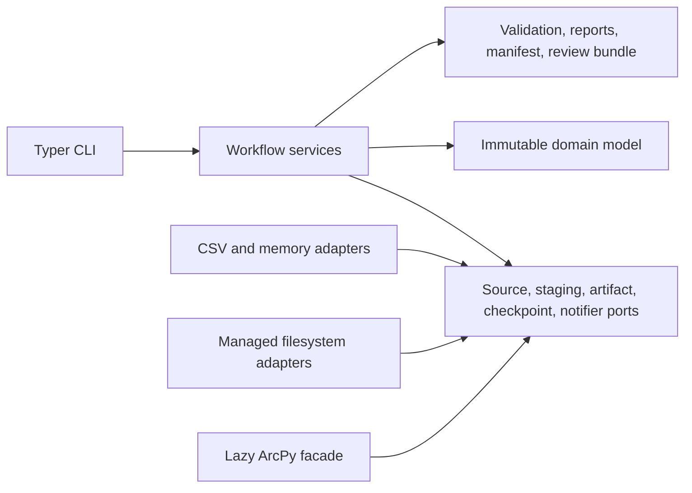
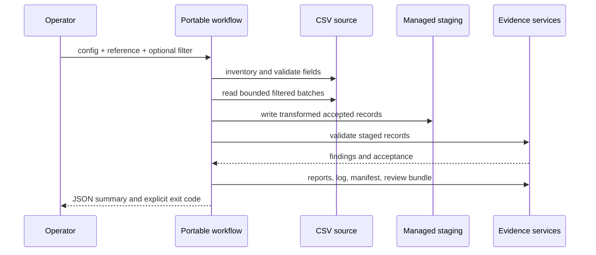

# Architecture

The toolkit uses a portable hexagonal architecture. Domain objects and
application services depend on protocols; adapters depend inward on those
ports. ArcPy remains outside the import graph until explicitly requested.

## Package Responsibilities

| Package | Responsibility |
| --- | --- |
| `domain` | Stable IDs, schemas, findings, run state, artifacts, checksums. |
| `ports` | Backend-neutral behavioral contracts. |
| `config` | Strict project boundary, interpolation, profiles, schema. |
| `inventory` | Deterministic dataset discovery and fingerprints. |
| `mapping` | Versioned reference tables and schema compatibility. |
| `filters` | AST, parser, evaluator, SQL compiler, ArcPy compiler. |
| `transformation` | Explicit registry and deterministic portable transforms. |
| `validation` | Record checks and acceptance decision policy. |
| `workflow` | DAG, batch execution, checkpoints, portable orchestration. |
| `reporting` | Shared report view and four output formats. |
| `evidence` | Canonical manifests and redacted structured events. |
| `review` | Non-deployment reviewer handoff. |
| `adapters` | Memory, CSV, managed filesystem, and lazy ArcPy boundaries. |

## Portable Run Sequence

The workflow does not call the deployment port. Accepted status means the
staging evidence is ready for human review, not that production deployment is
authorized.

## Integrity Properties

- Stable IDs normalize managed path components.
- Canonical JSON and SHA-256 make artifacts independently verifiable.
- Checkpoints include input and output checksums and UTC completion time.
- Filter text cannot execute arbitrary code.
- Reference and configuration parsers reject unknown or unsupported structure.
- Output paths reject absolute paths, traversal, and backslash ambiguity.
- Existing run directories are never silently replaced.
- Reports escape HTML and Markdown table content.
- Event and notification evidence redacts secret keys and known values.
